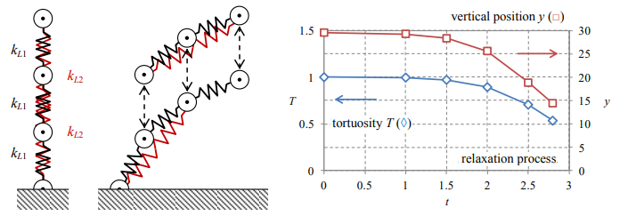

# bootree
Bamboo tree oscillation is modeled with spring and mass written in C++.

## files
+ [bootree.cpp](bootree.cpp) (not final)

## model and results

## note
+ `Event` The 6th International Conference of Mathematics and Natural Sciences (ICMNS 2016), 3-4 November 2016, Bandung, Indonesia, url <https://www.itb.ac.id/agenda/read/1538>
+ `Slide` S. Viridi, S. N. Khotimah, R. Kurniadi, Novitrian, K. Basar, A. Purqon, "Resonance condition of bamboo-like trees based on granular particle-spring model: Relaxation stage", SlideShare, 3 Nov, 2016, url <https://de.slideshare.net/sparisoma/resonance-condition-of-bamboolike-trees-based-on-granular-particlespring-model-relaxation-stage>
+ `Article` S. Viridi, M. Abdullah, N. Amalia, "Preliminary study of bamboo-like tree structure based on granular particle-spring model: Relaxation and tortuosity", Journal of Physics: Conference Series [J. Phys.: Conf. Ser.], vol. 1127, no. 1, p. 012019, Feb 2019, url <https://doi.org/10.1088/1742-6596/1127/1/012019>
