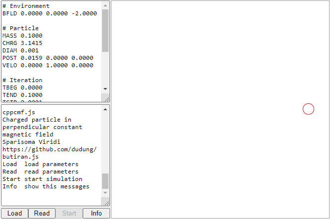

# cppcmf
Motion of charged particle in perpendicular constant magnetic field is simulated using JS by introducing a corrector of kinetic energy.
	

## files
+ [cppcmf.js](cppcmf.js)
+ [cppcmf.html](cppcmf.html)
+ [cppcmf-data.xls](cppcmf-data.xls)

## model and results

## note
+ `Event` The 5th Asian Physics Symposium (APS 2012), 10-12 July 2012, Bandung, Indonesia, url <https://www.itb.ac.id/news/read/3657/home/department-of-physics-holds-asian-physics-symposium>
+ `Article` D. Irawan, S. Viridi, S. N. Khotimah, F. D. E. Latief, Novitrian, "Modeling and Characterization of Charged Particle Trajectories in an Oscillating Magnetic Field", in The 5th Asian Physics Symposium-2012, edited by S. Viridi et al., AIP Conference Proceedings 1656, American Institute of Physics, Melville, NY, 2015, pp. 060009, url <http://dx.doi.org/10.1063/1.4917140>