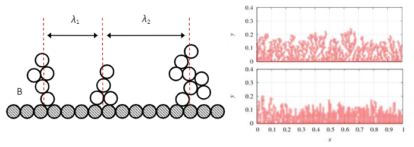

# depog2d
Granular particle deposition in two-dimensional system is simulated using C++.

## files
+ [depog2d.cpp](depog2d.cpp)

## model and results

## note
+ `Repository` S. Viridi, Suprijadi, V. Suendo, "Simulasi Deposisi Berdasarkan Penumbuhan Butiran Menggunakan Dinamika Molekular", url <https://docplayer.info/36010547-Simulasi-deposisi-berdasarkan-penumbuhan-butiran-menggunakan-dinamika-molekular.html>
+ `Article` S. Viridi, Suprijadi, V. Suendo, "Simulasi Deposisi Berdasarkan Penumbuhan Butiran Menggunakan Dinamika Molekular", Research and Development on Nanotechnology in Indonesia 2 (2), 68-79 (2015), url <http://nrcn.itb.ac.id/rdni/index.php/RDNI/article/view/38>