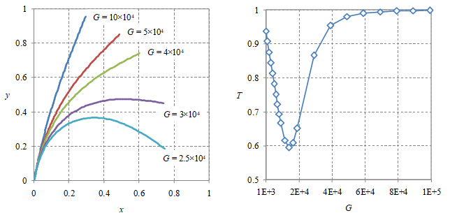

# nwcurve
Nanowire curvature due to its weight againts the shear modulus is calculated using C++.

## files
+ [nwcurve.cpp](nwcurve.cpp)

## results

## note
+ `Event` Symposium Nanotechnology, Research Center for Nanoscience and Nanotechnology ITB, 28-29 October 2016, Kuta, Indonesia, url <https://sites.google.com/view/e2mlab/activities?#:~:text=Symposium%20Nanotechnology%202016>
+ `Slide` S. Viridi, M. Abdullah, N. Amalia, "Two-dimension curvature of a wire: A simple model using shear modulus concept", SlideShare, 28 Oct, 2016, url <https://de.slideshare.net/sparisoma/twodimension-curvature-of-a-wire-a-simple-model-using-shear-modulus-concept>
+ `Preprint` S. Viridi, M. Abdullah, N. Amalia, "Two-Dimension Curvature of a Wire: A Simple Model using Shear Modulus Concept",  viXra:1610.0339 [v1] 2016-10-28 06:21:56, url <https://vixra.org/abs/1610.0339>
+ `Article` S. Viridi, M. Abdullah, N. Amalia, "Two-Dimension Curvature of a Wire: A Simple Model using Shear Modulus Concept", Research and Development on Nanotechnology in Indonesia 3 (1), 30-43 (2016), url <http://nrcn.itb.ac.id/rdni/index.php/RDNI/article/view/64>
