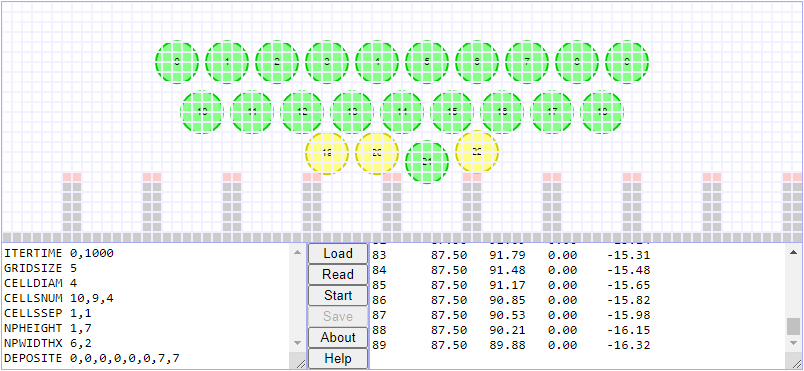

# abm-md-sc-pn
Stem cell (SC) deposition on nanopattern (NP) is simulated using molecular dynamics (MD) method and agent-based model (ABM) written in JS.

## files
+ [abm-md-sc-np.js](abm-md-sc-np.js)
+ [abm-md-sc-np.html](abm-md-sc-np.html)

## ui

## note
+ `Event` The 9th National Physics Seminar (SNF), 20 June 2020, Universitas Negeri Jakarta, Jakarta, Indonesia, url <https://snf2020.snf-unj.ac.id/>
+ `Slide` S. Viridi, Suprijadi, A. Barlian, D. R. Adhika, "Molecular Dynamics (MD) Method and Agent-Based Model (AMB) in Simulation of Stem Cell Deposition on the Surface with Nanopattern: Simulator Design", SlideShare, 27 Jun 2020, url <https://de2.slideshare.net/sparisoma/molecular-dynamics-md-method-and-agentbased-model-amb-in-simulation-of-stem-cell-deposition-on-the-surface-with-nanopattern-simulator-design>