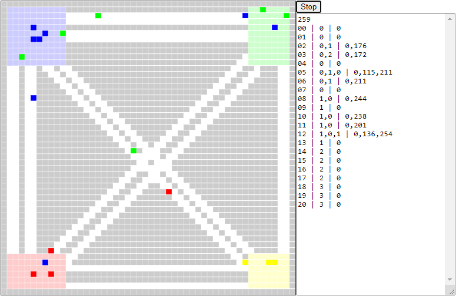

# abm-odm
Using agent-based model (ABM) written in JS, origin-destination matrix is simulated.

## files
+ [abm-odm.js](abm-odm.js)
+ [abm-odm.html](abm-odm.html)

## ui

## note
+ `Event` The 9th National Physics Seminar (SNF), 20 June 2020, Universitas Negeri Jakarta, Jakarta, Indonesia, url <https://snf2020.snf-unj.ac.id/>
+ `Slide` T. Suheri, S. Viridi, "The Relation between ABM (Agent-Based Model) and SIR (Susceptible-Infected-Recovered) Model for Spread of Disease", SlideShare, 20 Jun, 2020, url <https://de2.slideshare.net/sparisoma/constructing-origindestination-matrix-odm-using-agentbased-model-amb-in-multiple-points-commuting-system>