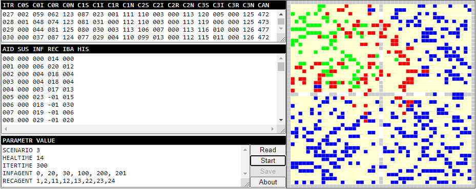

# abm-sir
Spread of disease is simulated using agent-based model (ABM) interacting through Susceptible-Infected-Recovered (SIR) model written in JS.

## files
+ [abm-sir.js](abm-sir.js)
+ [abm-sir.html](abm-sir.html)

## ui

## note
+ `Event` The 9th National Physics Seminar (SNF), 20 June 2020, Universitas Negeri Jakarta, Jakarta, Indonesia, url <https://snf2020.snf-unj.ac.id/>
+ `Slide` A. Susandi, I. Taufik, P. Aditiawati, S. Viridi, "The Relation between ABM (Agent-Based Model) and SIR (Susceptible-Infected-Recovered) Model for Spread of Disease", SlideShare, 19 Jun, 2020, url <https://de2.slideshare.net/sparisoma/the-relation-between-abm-agentbased-model-and-sir-susceptibleinfectedrecovered-model-for-spread-of-disease>