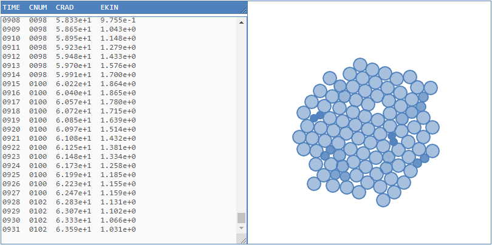

# cellasexreprodforces
Asexual reproduction of cells through budding and binary fission are simulated using molecular dynamics (MD) method and agent-based model (ABM) ritten in JS.

## files
+ [cellasexreprodforces.js](cellasexreprodforces.js)
+ [cellasexreprodforces.html](cellasexreprodforces.html)

## ui

## note
+ `Event` International Conference and School on Physics in Medicine and Biosystems, 6-8 November 2020, IPB University, Bogor, Indonesia, url <https://www.icspmb.org/>
+ `Slide` S. Viridi, Suprijadi, "Simulation of cell budding & binary fission: A preliminary study using molecular dynamics + agent-based model", SlideShare, 7 Nov, 2020, url <https://de2.slideshare.net/sparisoma/simulation-of-cell-budding-binary-fissiona-preliminary-study-using-molecular-dynamics-agentbased-model>