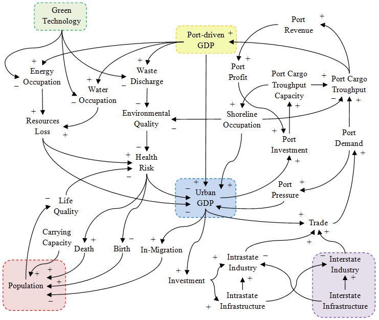

# greenport
A proposed model for Patimban deep sea port as a green port is simulated using system dynamics written in JS.

## files
+ [greenport.js](greenport.js)
+ [greenport.html](greenport.html)

## causal loop diagram

## note
+ `Event` Conference on Sustainability and Resilience of Coastal Management 2020, 30 November 2020, Surabaya, Indonesia, url <https://www.its.ac.id/drpm/srcm/>
+ `Slide` T. Suheri, M. B. Alexandri, S. J. Raharja, M. Purnomo, S. Viridi, "Interaction between Marine Sectors using System Dynamics for Patimban Deep Sea Port as a Green Port: Proposed Model", SlideShare, 29 Nov, 2020, url <https://de2.slideshare.net/sparisoma/interaction-between-marine-sectors-using-system-dynamics-for-patimban-deep-sea-port-as-a-green-porta-proposed-model>