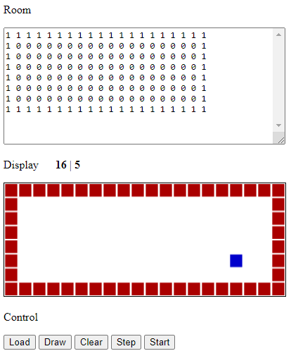
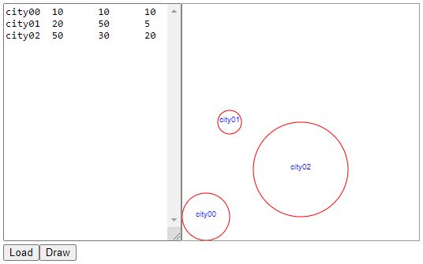
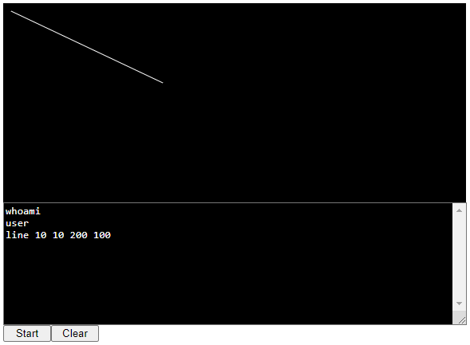

# visualize-thing
Some experiments are conducted to visualize some information using JS.

## files
+ [abm_4.js](abm_4.js)
+ [abm_4.html](abm_4.html)
+ [draw2d.js](draw2d.js)
+ [draw2d.html](draw2d.html)
+ [tacon3.js](tacon3.js)
+ [tacon3.html](tacon3.html)

## ui

## note
+ The three JS are still experimental in visualizing information
