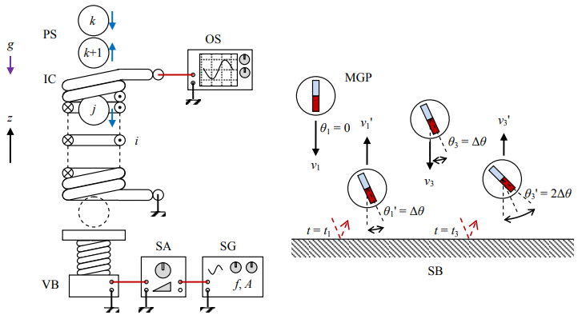

# ics1vmgps
Simulation of induced current while a single magnetic granular particle is bounching on stationary base through a solenoid.

## system

## files
+ [ics1vmgps.xls](ics1vmgps.xls)

## note
+ `Event` The 2nd International Conference on Applied Electromagnetic Technology (AEMT) 2018, 9-12 April 2018, Mataram, Indonesia, url <https://aemt-geomagnetic.org/english/aemt/>
+ `Slide` S. Viridi, Suprijadi, "Induced Current Simulation of One-Dimensional Vibrating Magnetic Granular Particles System: Free Fall of Single Magnetic Granular Particle Hitting Stationary Base", SlideShare, 8 Apr 2018, url <https://de2.slideshare.net/sparisoma/induced-current-simulation-of-onedimensional-vibrating-magnetic-granular-particles-system-free-fall-of-single-magnetic-granular-particle-hitting-stationary-base>
+ `Abstract` S. Viridi, Suprijadi, "Induced Current Simulation of One-Dimensional Vibrating Magnetic Granular Particles System", The 2nd International Conference on  Applied Electromagnetic Technology (AEMT) 2018, url <https://aemt-geomagnetic.org/onewebmedia/AEMT/Proceedings/1.%20Proceeding%20AEMT%202018.pdf#page=119>
+ `Article` S. Viridi, Suprijadi, "Induced Current Simulation of One-Dimensional Vibrating Magnetic Granular Particles System", 2018 2nd International Conference on Applied Electromagnetic Technology (AEMT), Lombok, 2018, pp. 50-56, doi: [10.1109/AEMT.2018.8572401](https://doi.org/10.1109/AEMT.2018.8572401).