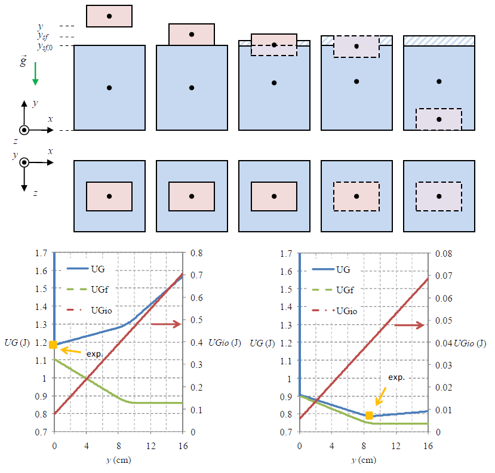

# pmpe-bf
Principle of minimum potential energy is applied for buoyant force and written in JS.

## system

## files
+ [pmpe-bf.xlsx](pmpe-bf.xlsx)

## note
+ `Event` 10th International Conference on Theoretical and Applied Physics (ICTAP), 20-22 November 2020, Universitas Mataram, Mataram, Indonesia, url <https://ictap.unram.ac.id/>
+ `Slide` J. Sabaryati, L. S. Utami, A. W. Hasanah, S. Viridi, "Viewing Buoyant Force as an Application of Principle of Minimum Potential Energy", WhatsApp (private communication), 16 Nov 2020, ICTAP 2020.pptx