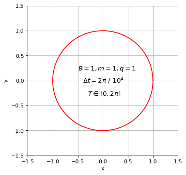
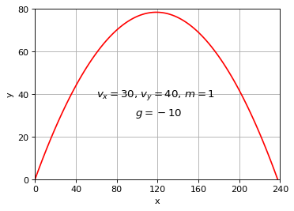

# 202209
Sep 2022 logs

## notes
+ **`14-sep-2022`** [1e1fe5a9cf](https://github.com/dudung/butiran/tree/1e1fe5a9cf)
  - Make new module `Grain`.
  - Add `import sys` and `sys.path.insert(0, '..')` lines to access `butiran` folder inside root folder (Deily, 2013).
+ **`15-sep-2022`** [4ff20f4ce8](https://github.com/dudung/butiran/tree/4ff20f4ce8)
  - Try to mimic some syntax of [Spinx](https://www.sphinx-doc.org/en/master/) for arguments of a class.
+ **`16-sep-2022`** [c6a90fad0c](https://github.com/dudung/butiran/tree/c6a90fad0c)
  - Begin more serious to document in `docs`.
  - Do `Color2` and `Grain` modules
+ **`17-sep-2022`** [fee38a97db](https://github.com/dudung/butiran/tree/fee38a97db)
  - Begin `force.magnetic` module.
  - Implement `assert` in `force.magnetic` module to assure that `field` is type of `Vect3` (Ramos, 2022).
+ **`18-sep-2022`** [83e8e44648](https://github.com/dudung/butiran/tree/83e8e44648)
  - Comment `import sys` and `sys.path.insert(0, '..')` lines and set `PYTHONPATH` environment variabel to root folder (RajuKumar19, 2022). 
  - Plot result of [`test_circ_mot_mag_field_euler.py`](../tests/test_circ_mot_mag_field_euler.py) file (GeeksforGeeks et al., 2022).
  - Change size of the figure to be square (Seppänen & Luis Mendo, 2022). Modify axes range (Spronck, 2015).
  - Save output in PNG format to file using `savefig()` function (Hooked & Mateen Ulhaq, 2022).
  - Add lines of text to figure (greeshmanalla, 2021).
    
  - Move part or `README.md` from `tests` folder to `logs`.
  - Create `logs` and store all previous, remembered commits.
+ **`19-sep-2022`**
  - Begin creating `butiran.force.gravitational` module. To-do is text.
    
  - Finish put text in the figure. \
    $t \in [0, 8]$ \
    $x = 30t$ \
    $y = 40t - 5t^2$

## refs
+  Anthony Shaw, "Getting Started With Testing in Python", Real Pyhton, 14 Apr 2022, url <https://realpython.com/python-testing/> [20220917].
+ Leodanis Pozo Ramos , "Python's assert: Debug and Test Your Code Like a Pro", Real Python, 23 Feb 2022, url <https://realpython.com/python-assert-statement/> [20220918].
+ RajuKumar19, "PYTHONPATH Environment Variable in Python", GeeksforGeeks, 5 Sep 2022, url <https://www.geeksforgeeks.org/pythonpath-environment-variable-in-python/> [20220918].
+ Ned Deily, "Answer to 'adding directory to sys.path /PYTHONPATH'", Stack Overflow, 19 Apr 2013,  url <https://stackoverflow.com/a/16114586/9475509> [20220918].
+ GeeksforGeeks, kk9826225, sumitgumber28, pujasingg43, "Graph Plotting in Python | Set 1", GeeksforGeeks, 15 Jul 2022, url <https://www.geeksforgeeks.org/graph-plotting-in-python-set-1/> [20220918].
+ Jouni K. Seppänen, Luis Mendo, "Answer to 'How do I change the size of figures drawn with Matplotlib?'", Stack Overflow, 12 Mar 2009, 22 Apr 2022, url <https://stackoverflow.com/a/638443/9475509> [20220918].
+ Julien Spronck, "Answer to 'How to change the range of the x-axis and y-axis in matlibplot?'", Stac Overflow, 30 Mar 2015, url <https://stackoverflow.com/a/29337203/9475509> [20220918].
+ Hooked, Mateen Ulhaq, "Answer to'Save plot to image file instead of displaying it using Matplotlib'", Stack Overflow, 27 Mar 2012, 6 Jun 2022, url <https://stackoverflow.com/a/9890599/9475509> [20220918].
+ greeshmanalla, "Add Text Inside the Plot in Matplotlib", GeeksforGeeks, 3 Jan 2021, url <https://www.geeksforgeeks.org/add-text-inside-the-plot-in-matplotlib/> [20220918].