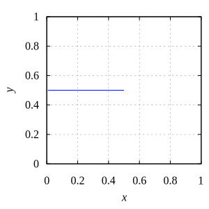
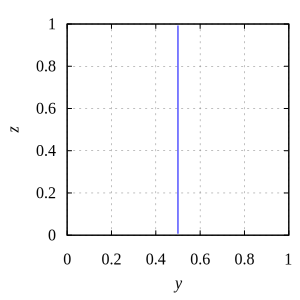
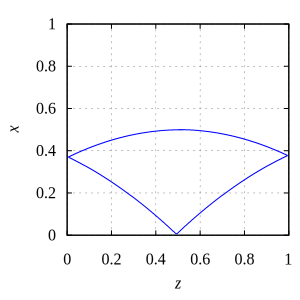
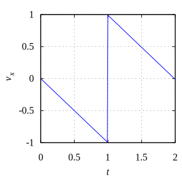
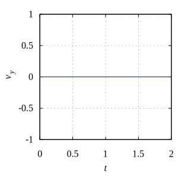
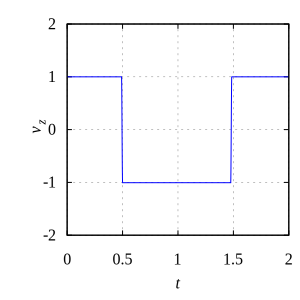

# box_2d_parabolic
parabolic motion of a spherical grain in a 2d-box 

## graphics
  
  

## parameters
+ $\vec{g} = (-1, 0, 0)$
+ $k_N = 1000$, $\gamma_n = 0$,
+ $x \in [0, 1]$, $y \in [0, 1]$, $z \in [0, 1]$,
+ $t \in [0, 2]$, $\Delta t = 10^{-3}$,
+ $\vec{r}_0 = (\tfrac12, \tfrac12, \tfrac12)$, $\vec{v}_0 = (0, 0, 1)$,
+ $d = 0.02$, $m = 0.01$.

## codes
+ [simulate.py](simulate.py)
+ [plot.gnu](plot.gnu)
